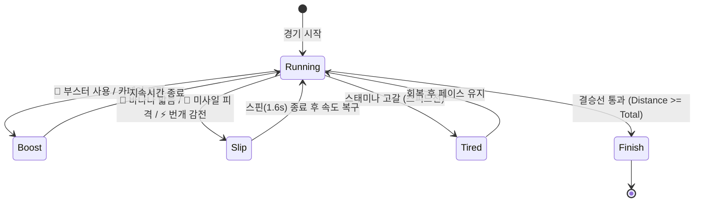

# 01. 전체 아키텍처 (Architecture)

## 1. 개요 및 설계 철학
오피스 더비(Office Derby)는 **100% 무중단 클라이언트 사이드(Zero Backend)**로 구동되는 사내 커피내기 경마 게임입니다.
순수 비즈니스 로직(물리, 아이템, 벌칙 계산, AI 전략)과 렌더링/UI 계층을 엄격히 분리하여 **100% 테스터블(Testable)**하게 설계되었습니다.

```
[ UI Layer (index.html, css/ ) ]
           ▲
           │ User Input / DOM Events
           ▼
[ Application Controller (app.js) ]
  ├── PresetManager (presetManager.js) ──► localStorage
  ├── PenaltyCalculator (penalty.js)
  └── SoundEngine (sound.js - Web Audio Synth)
           ▲
           │ Event Callbacks & State Sync
           ▼
[ Core Simulation Engine (raceEngine.js) ]
  ├── ItemManager (itemManager.js)
  ├── OnDeviceAIEngine (aiEngine.js)
  └── CanvasRenderer (canvasRenderer.js - 60FPS Canvas 2D)
```

---

## 2. 모듈별 역할 및 책임 (Separation of Concerns)

### 1) Core Logic Modules (순수 로직, 무의존성, 완전 테스트 가능)
- **`js/penalty.js`**: 벌칙 룰(`last1`, `last2`, `winnerSafe`, `randomTarget`)에 따른 결제자 산정 및 예상 커피 금액 계산.
- **`js/itemManager.js`**: 아이템 상자 체크포인트 생성, 확률 기반 획득, 아이템 발동, 다중 레인 추격자 바나나 매설, 미사일 궤적 계산, 장애물 충돌 및 쉴드 방어.
- **`js/presetManager.js`**: 사내 팀원 프리셋 목록 직렬화, localStorage CRUD, 참가자 데이터 객체 팩토리.
- **`js/aiEngine.js`**: Chrome `window.ai` (Gemini Nano) 세션 연결 및 브라우저 자체 오프라인 생성기, 5대 AI 성향별 프롬프트/의사결정 루프, 경기 실시간 중계 합성, 경기 후 1면 기사 생성.
- **`js/raceEngine.js`**: 델타 타임(`dt`) 기반 물리 시뮬레이션, 순위 랭킹 실시간 갱신, 완주 타이밍, 상태 머신 관리.

### 2) Presentation & Audio Layer (브라우저 종속 계층)
- **`js/canvasRenderer.js`**: HTML5 Canvas 2D 기반 60FPS 부드러운 렌더러. 말 달리기 애니메이션, 꼬리 흔들림, 기수 모션, 부스터 화염/연기 파티클, 쉴드 오라, 미니맵, 결승선 게이트.
- **`js/sound.js`**: Web Audio API 오실레이터(Oscillator) 기반 신디사이저. 외부 MP3 다운로드 없이 출발 총성, 다그닥 말발굽 리듬, 부스터 폭발음, 미끄러짐 음, 골인 팡파르 합성.
- **`js/commentator.js`**: 실시간 해설 자막 UI 큐 관리 및 자동 스크롤.
- **`js/app.js`**: 전체 라이프사이클 조율, DOM 이벤트 리스너, 모달 렌더링, 클립보드 복사.

---

## 3. 상태 머신 (Horse State Machine)

각 말은 매 프레임 아래의 상태 중 하나를 유지하며 물리 연산을 수행합니다:


